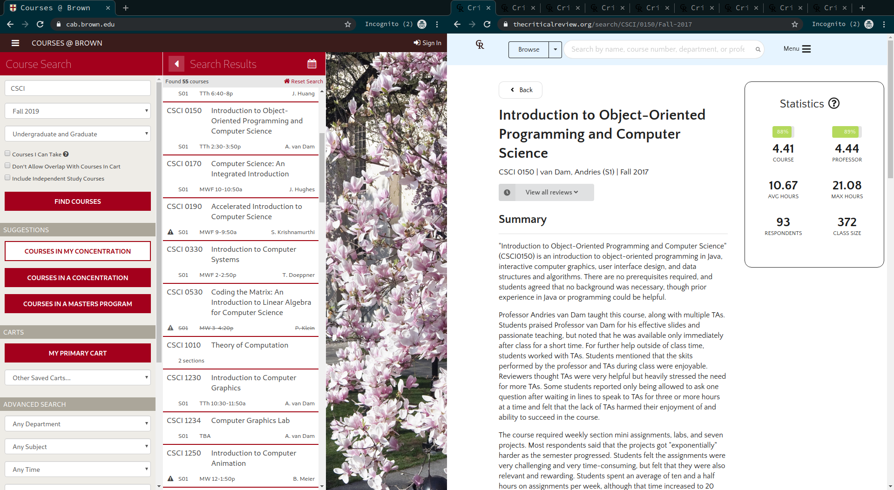
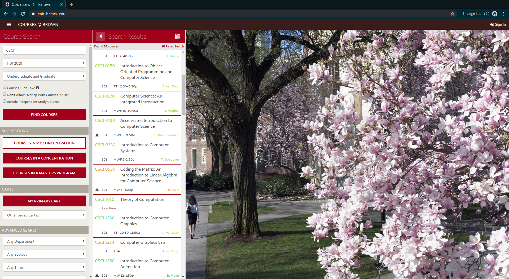

# Critical Review @ CAB

Say goodbye to opening tab upon tab of reviews when searching for courses, and see the average scores courses and professors received right in CAB's search results! New professor taking over a course? No problem—any reviews they've received for other courses will be factored in so you know what to expect.

## Screenshots

### Before

### After

## Installation

Coming soon to the Chrome web store!